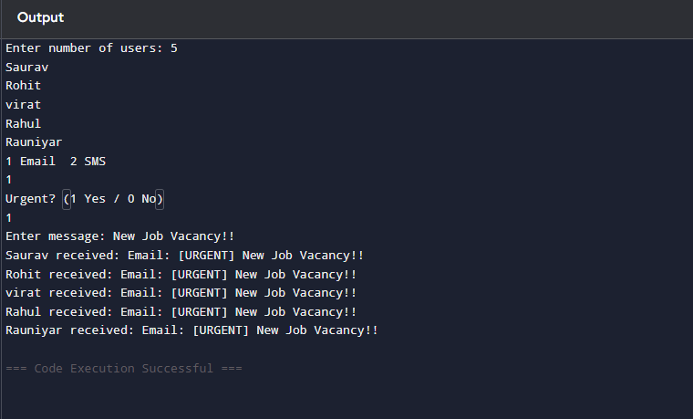

# Smart Notification System

## Description
This is a Java-based Smart Notification System project.
## Project Type
Console-based Java Application
## Features
- Send notifications
- Manage alerts
- Simple Java logic

## Technology Used
- Java
## How to Run
1. Compile the program
2. Run Main.java
3. Enter user details as prompted
## Author
Saurav Kumar
## Example Run

